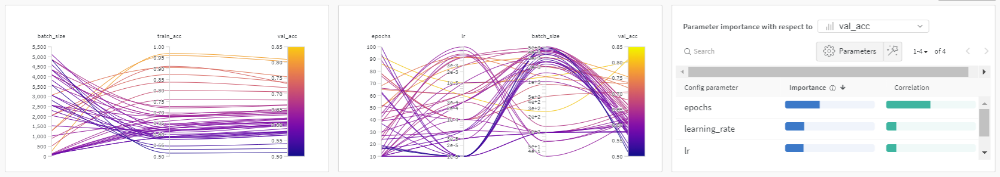
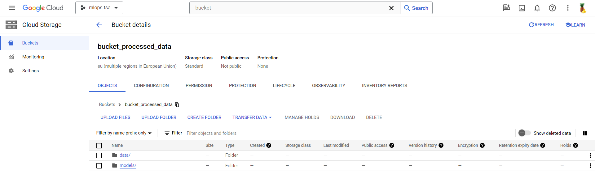
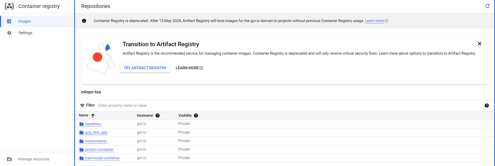
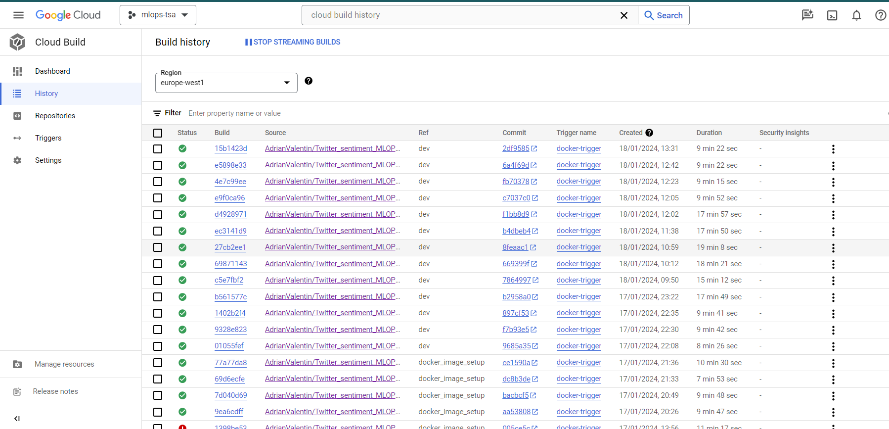
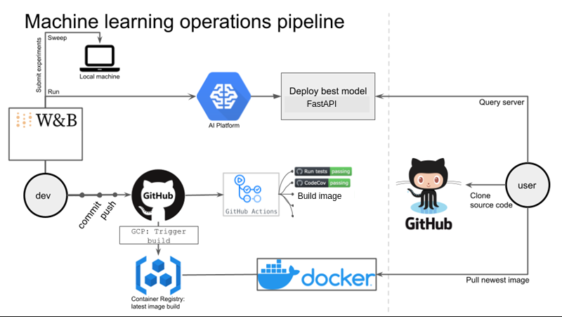

# Exam template for 02476 Machine Learning Operations

This is the report template for the exam. Please only remove the text formatted as with three dashes in front and behind
like:

```--- question 1 fill here ---```

where you instead should add your answers. Any other changes may have unwanted consequences when your report is auto
generated in the end of the course. For questions where you are asked to include images, start by adding the image to
the `figures` subfolder (please only use `.png`, `.jpg` or `.jpeg`) and then add the following code in your answer:

```markdown

```

In addition to this markdown file, we also provide the `report.py` script that provides two utility functions:

Running:

```bash
python report.py html
```

will generate an `.html` page of your report. After deadline for answering this template, we will autoscrape
everything in this `reports` folder and then use this utility to generate an `.html` page that will be your serve
as your final handin.

Running

```bash
python report.py check
```

will check your answers in this template against the constrains listed for each question e.g. is your answer too
short, too long, have you included an image when asked to.

For both functions to work it is important that you do not rename anything. The script have two dependencies that can
be installed with `pip install click markdown`.

## Overall project checklist

The checklist is *exhaustic* which means that it includes everything that you could possible do on the project in
relation the curricilum in this course. Therefore, we do not expect at all that you have checked of all boxes at the
end of the project.

### Week 1

* [ ] Create a git repository
* [ ] Make sure that all team members have write access to the github repository
* [ ] Create a dedicated environment for you project to keep track of your packages
* [ ] Create the initial file structure using cookiecutter
* [ ] Fill out the `make_dataset.py` file such that it downloads whatever data you need and
* [ ] Add a model file and a training script and get that running
* [ ] Remember to fill out the `requirements.txt` file with whatever dependencies that you are using
* [ ] Remember to comply with good coding practices (`pep8`) while doing the project
* [ ] Do a bit of code typing and remember to document essential parts of your code
* [ ] Setup version control for your data or part of your data
* [ ] Construct one or multiple docker files for your code
* [ ] Build the docker files locally and make sure they work as intended
* [ ] Write one or multiple configurations files for your experiments
* [ ] Used Hydra to load the configurations and manage your hyperparameters
* [ ] When you have something that works somewhat, remember at some point to to some profiling and see if
      you can optimize your code
* [ ] Use Weights & Biases to log training progress and other important metrics/artifacts in your code. Additionally,
      consider running a hyperparameter optimization sweep.
* [ ] Use Pytorch-lightning (if applicable) to reduce the amount of boilerplate in your code

### Week 2

* [ ] Write unit tests related to the data part of your code
* [ ] Write unit tests related to model construction and or model training
* [ ] Calculate the coverage.
* [ ] Get some continuous integration running on the github repository
* [ ] Create a data storage in GCP Bucket for you data and preferable link this with your data version control setup
* [ ] Create a trigger workflow for automatically building your docker images
* [ ] Get your model training in GCP using either the Engine or Vertex AI
* [ ] Create a FastAPI application that can do inference using your model
* [ ] If applicable, consider deploying the model locally using torchserve
* [ ] Deploy your model in GCP using either Functions or Run as the backend

### Week 3

* [ ] Check how robust your model is towards data drifting
* [ ] Setup monitoring for the system telemetry of your deployed model
* [ ] Setup monitoring for the performance of your deployed model
* [ ] If applicable, play around with distributed data loading
* [ ] If applicable, play around with distributed model training
* [ ] Play around with quantization, compilation and pruning for you trained models to increase inference speed

### Additional

* [ ] Revisit your initial project description. Did the project turn out as you wanted?
* [ ] Make sure all group members have a understanding about all parts of the project
* [ ] Uploaded all your code to github

## Group information

### Question 1
> **Enter the group number you signed up on <learn.inside.dtu.dk>**
>
> Answer:

--- 45 ---

### Question 2
> **Enter the study number for each member in the group**
>
> Example:
>
> *sXXXXXX, sXXXXXX, sXXXXXX*
>
> Answer:

--- s201390, s204129, s204104 ---

### Question 3
> **What framework did you choose to work with and did it help you complete the project?**
>
> Answer length: 100-200 words.
>
> Example:
> *We used the third-party framework ... in our project. We used functionality ... and functionality ... from the*
> *package to do ... and ... in our project*.
>
> Answer:

--- In our project, we utilized a pre-trained model from Huggingface to tokenize and embed a dataset of tweets. This transformer package streamlined the process of loading the model and implementing tokenization and embedding functions. For integrating these embeddings into our custom neural network, we chose PyTorch Lightning. To manage versions of our data and code, we used DVC and Git, complemented by Ruff for code formatting our code to be Pep8 compliant and Pipreqs for updating our requirements file. Moreover, we used Evidently to monitor any data drift in our test set. Lastly, Weights & Biases were utilized in tracking loss and accuracy, and facilitating hyperparameter tuning. ---

## Coding environment

> In the following section we are interested in learning more about you local development environment.

### Question 4

> **Explain how you managed dependencies in your project? Explain the process a new team member would have to go**
> **through to get an exact copy of your environment.**
>
> Answer length: 100-200 words
>
> Example:
> *We used ... for managing our dependencies. The list of dependencies was auto-generated using ... . To get a*
> *complete copy of our development environment, one would have to run the following commands*
>
> Answer:

--- OBS> tjek kommando for docker
We used conda, pipreqs, docker, and git to manage our dependencies. The list of dependencies was auto-generated using pipregs where the dependencies exclusevly for development is in requirements_dev.txt and to run the project you would need the dependencies from requirements.txt. So to run the project you would need build the docker image and run that container:
'docker build -f Docker.dockerfile . -t trainer:latest.'

As a new team member you would need to be added as collaborator in Github, clone the repository and run the following commands in their conda environment:
'pip install -r requirements.txt', 'pip install -r requirements.txt' 'pip install -e .'
 where '-e .' is to install local packages in the repository---

### Question 5

> **We expect that you initialized your project using the cookiecutter template. Explain the overall structure of your**
> **code. Did you fill out every folder or only a subset?**
>
> Answer length: 100-200 words
>
> Example:
> *From the cookiecutter template we have filled out the ... , ... and ... folder. We have removed the ... folder*
> *because we did not use any ... in our project. We have added an ... folder that contains ... for running our*
> *experiments.*
> Answer:

--- OBS tjek om folderne er fjernet.. 

From the cookiecutter template we have filled out the data folder to store our data, both raw and processed, dockerfiles folder for the different docker files, models for the best performing models, test folder for our unit testing and outputs folders for ....(images of the results) and in the project folder we used the data folder for our data script, the models folder for the neural network, visualizations for visualizing script as well as all the training scripts for both the training and inference of our KNN model and our neural network.

We removed the folder notebooks since we never used any notebooks. 

We added the folders logs, to add the logs for WandB, profiling and lightning. 
  ---

### Question 6

> **Did you implement any rules for code quality and format? Additionally, explain with your own words why these**
> **concepts matters in larger projects.**
>
> Answer length: 50-100 words.
>
> Answer:

---  
Our code adheres to PEP8 standards, thanks to Ruff. Adhering to these rules for code formatting and quality is crucial, as they guarantee consistency, maintainability, and readability, especially in large-scale projects. Such practices enhance collaboration, minimize errors, and lead to more efficient use of time and resources. Generally consistency leads to better readibility. ---

## Version control

> In the following section we are interested in how version control was used in your project during development to
> corporate and increase the quality of your code.

### Question 7

> **How many tests did you implement and what are they testing in your code?**
>
> Answer length: 50-100 words.
>
> Example:
> *In total we have implemented X tests. Primarily we are testing ... and ... as these the most critical parts of our*
> *application but also ... .*
>
> Answer:

--- We have successfully implemented a total of 16 tests in our project. Among these, four tests are specifically designed to ensure that the data is accurate and compliant with the requirements of the subsequent training process. The remaining 11 tests are focused on guaranteeing that the training process will proceed without any issues. These tests collectively contribute to the reliability and efficiency of our system, ensuring that each stage, from data preparation to training, functions as intended and meets our quality standards.---

### Question 8

> **What is the total code coverage (in percentage) of your code? If you code had an code coverage of 100% (or close**
> **to), would you still trust it to be error free? Explain you reasoning.**
>
> Answer length: 100-200 words.
>
> Example:
> *The total code coverage of code is X%, which includes all our source code. We are far from 100% coverage of our **
> *code and even if we were then...*
>
> Answer:

--- We have a code coverage on 61% in this project. 

Achieving 100% code coverage is not a direct indicator of a bug-free codebase. This metric only reflects the proportion of the codebase that is exercised during tests, not the effectiveness of those tests or the accuracy of the underlying code logic. Complete code execution during testing doesn't rule out the presence of bugs or errors. Moreover, code coverage often overlooks potential edge cases and unforeseen input scenarios that could lead to failures. As a result, comprehensive testing and good code reviews are crucial for assuring the code's overall quality and dependability. ---

### Question 9

> **Did you workflow include using branches and pull requests? If yes, explain how. If not, explain how branches and**
> **pull request can help improve version control.**
>
> Answer length: 100-200 words.
>
> Example:
> *We made use of both branches and PRs in our project. In our group, each member had an branch that they worked on in*
> *addition to the main branch. To merge code we ...*
>
> Answer:

---We utilized both branches and pull requests (PRs) in our project. Our group established a development branch off the master branch. From this development branch, we created individual feature branches for each specific feature we needed to work on. Whenever we started developing a new feature, we made a corresponding branch. The team member assigned to that feature would work on this branch. If another group member needed to contribute to the same feature, the branch was pushed, allowing the new member to access it and continue the work.

Once a feature was completed, we created a pull request from the feature branch to the development branch and merged the new feature, subsequently closing the feature branch. In the development branch, we conducted tests to ensure all features worked together seamlessly. If successful, a pull request was made from the development branch to the master branch, where the new changes were merged. ---

### Question 10

> **Did you use DVC for managing data in your project? If yes, then how did it improve your project to have version**
> **control of your data. If no, explain a case where it would be beneficial to have version control of your data.**
>
> Answer length: 100-200 words.
>
> Example:
> *We did make use of DVC in the following way: ... . In the end it helped us in ... for controlling ... part of our*
> *pipeline*
>
> Answer:

--- Initially we used DVC from Google Drive and then GCP bucket. Although we set up data version control, our data was only updated once where we got more data uploaded. But it helped us sharing the data after it was prepocessed, since one team memeber had GPU power to process the data faster than the others. 

DVC is useful for managing data in projects where multiple team members are working on the same dataset. It allows team members to collaborate on the dataset and implement changes without affecting each other's contributions. DVC also provides a straightforward way to track modifications and offers the option to revert to earlier versions if needed. Additionally, it aids in reproducing results and keeping a clear record of the dataset's history, which is important for transparency and reproducibility in research. Overall, DVC supports efficient collaboration and responsible data management.---

### Question 11

> **Discuss you continues integration setup. What kind of CI are you running (unittesting, linting, etc.)? Do you test**
> **multiple operating systems, python version etc. Do you make use of caching? Feel free to insert a link to one of**
> **your github actions workflow.**
>
> Answer length: 200-300 words.
>
> Example:
> *We have organized our CI into 3 separate files: one for doing ..., one for running ... testing and one for running*
> *... . In particular for our ..., we used ... .An example of a triggered workflow can be seen here: <weblink>*
>
> Answer:

--- Unit tests were implemented for all training data and for the train model pipeline. In total, 5 unit tests are executed automatically when pushing to Git. This is done by having the appropriate workflow file. GitHub has access to the data when executing the unit tests. The data is located in cloud storage buckets where a service account has been set up so that GitHub can pull the data using DVC when running the tests. Additionally, the workflow generates a coverage report which is saved as an artifact. Docker images are built on GCloud when pushed to the development branch, as determined by a cloudbuild.yaml and trigger located in Cloud Build. These Docker images pertain to training the model and the model inference API. Additionally, we have built another Dockerfile and pipeline. These images are pushed to the container registry under different folders. They are also tagged with "latest" such that when running other applications, it is always the newest image.  


We have not used any pre-commit hooks, although we have used Ruff for manually linting files. We only used the latest Ubuntu operating system when running the unit tests. We also do not make use of cache, and only use python 3.10. The link to the workflow file is included here https://github.com/AdrianValentin/Twitter_sentiment_MLOPS/blob/dev/.github/workflows/test.yml.---

## Running code and tracking experiments

> In the following section we are interested in learning more about the experimental setup for running your code and
> especially the reproducibility of your experiments.

### Question 12

> **How did you configure experiments? Did you make use of config files? Explain with coding examples of how you would**
> **run a experiment.**
>
> Answer length: 50-100 words.
>
> Example:
> *We used a simple argparser, that worked in the following way: python my_script.py --lr 1e-3 --batch_size 25*
>
> Answer:

--- We used WandB's sweep configuration function to sweep for the optimal hyper parameters. We defined ranges for the different hyperparamters, and then using both grid and random search these ranges would be used in different runs. From root directory we would call the function with the defined parameters sweep:
'python twitter_sentiments_MLOPS/train_model_sweep_wandb.py'
Then you would need to head over to the project's WandB project to examine the results more deeply or look in the terminal for a brief understanding of the results.
 ---

### Question 13

> **Reproducibility of experiments are important. Related to the last question, how did you secure that no information**
> **is lost when running experiments and that your experiments are reproducible?**
>
> Answer length: 100-200 words.
>
> Example:
> *We made use of config files. Whenever an experiment is run the following happens: ... . To reproduce an experiment*
> *one would have to do ...*
>
> Answer:

--- We made use of WandB's configuration function and with randomly selected values between the chosen hyperparameters that we would like to experiment with. Whenever an experiment is run the models performance is then logged into WandB and we could find the optimal model here and choose the right combination of hyperparameters for the best performance. Furthermore a seed was used in datasplitting. 
To reproduce one of the runs, specific values should be put in the sweep config, and the same seed (42) should be used. Then lastly you would need to run the script from root dir. by:
'python twitter_sentiments_MLOPS/train_model_sweep_wandb.py' ---

### Question 14

> **Upload 1 to 3 screenshots that show the experiments that you have done in W&B (or another experiment tracking**
> **service of your choice). This may include loss graphs, logged images, hyperparameter sweeps etc. You can take**
> **inspiration from [this figure](figures/wandb.png). Explain what metrics you are tracking and why they are**
> **important.**
>
> Answer length: 200-300 words + 1 to 3 screenshots.
>
> Example:
> *As seen in the first image when have tracked ... and ... which both inform us about ... in our experiments.*
> *As seen in the second image we are also tracking ... and ...*
>
> Answer:

---In our project, we have chosen WandB for tracking experiments, a decision that has significantly aided in understanding and optimizing our model's performance. The included figure, referred to as  , presents several graphs, each offering valuable insights.

The first graph in the figure demonstrates the relationship between batch size, and both training and validation accuracies. It's a key visual tool showing how batch size impacts model performance, revealing an interesting trend: smaller batch sizes are generally associated with higher accuracies in both training and validation phases. This information is crucial for us, as it guides the optimization of batch sizes to enhance overall model accuracy.

The second graph delves into the interactions among various hyperparameters – epochs, learning rate, and batch size – and their effects on validation accuracy. This visualization is important for identifying the most effective combination of hyperparameters, leading us towards the optimal configuration for our model. It helps in understanding the complex interplay of these variables and their influence on model performance.

Furthermore, the final plot in the figure examines the correlation between these hyperparameters and validation accuracy, highlighting a notable finding: a higher number of epochs shows a strong correlation with increased accuracy rates. This insight is significant, as it emphasizes the importance of epochs in the model's learning process, suggesting that increasing epochs could be key to improving accuracy. ---

### Question 15

> **Docker is an important tool for creating containerized applications. Explain how you used docker in your**
> **experiments? Include how you would run your docker images and include a link to one of your docker files.**
>
> Answer length: 100-200 words.
>
> Example:
> *For our project we developed several images: one for training, inference and deployment. For example to run the*
> *training docker image: `docker run trainer:latest lr=1e-3 batch_size=64`. Link to docker file: <weblink>*
>
> Answer:

--- For our project we developed several images: one for training our neural network model called FCNN, one for our baseline model using KNN and one for doing prediction containing our FastAPI function to do the inference. For example to run the predict docker image, it must first be built using the console command: 
'docker build -f 'dockerfiles/predict_model.dockerfile' -t twitter-sentiment-app .',
and then ran with: 'docker run -it --rm -p 80:80 twitter-sentiment-app'. Both commands should be used from root directory. Going to http://127.0.0.1:80/docs will provide an inference tool, where it is possible to add a tweet and get a sentiment analysis. <https://github.com/AdrianValentin/Twitter_sentiment_MLOPS/blob/dev/dockerfiles/predict_model.dockerfile> ---

### Question 16

> **When running into bugs while trying to run your experiments, how did you perform debugging? Additionally, did you**
> **try to profile your code or do you think it is already perfect?**
>
> Answer length: 100-200 words.
>
> Example:
> *Debugging method was dependent on group member. Some just used ... and others used ... . We did a single profiling*
> *run of our main code at some point that showed ...*
>
> Answer:

-- We debugged primarily with the inbuilt debugging tool in pycharm and vs-code. This was sufficient for most of the project. However, when wandb and fastapi was involved, this was harder to do - so we confined to also using a few print statements, which led us to now where the error was and what different variables contained. We used pytorch lightning profilling with the package profilers on the code, and created reports on this. From this we learned, that most of the training time was spend during the optimizer step and next the training step. We could also use profiling for understanding how much cpu or gpu was used for the different functions.  ---

## Working in the cloud

> In the following section we would like to know more about your experience when developing in the cloud.

### Question 17

> **List all the GCP services that you made use of in your project and shortly explain what each service does?**
>
> Answer length: 50-200 words.
>
> Example:
> *We used the following two services: Engine and Bucket. Engine is used for... and Bucket is used for...*
>
> Answer:

--- We used: Container Registry for storing the docker containers we used. Vertex AI for training our models. Cloud build for building docker images. Cloud storage for storing trained models (weights + bias) and data (embeddings and labels) and easily access the data through DVC. Cloud run is used for deploying and scaling our containerized application quickly and efficiently. ---

### Question 18

> **The backbone of GCP is the Compute engine. Explained how you made use of this service and what type of VMs**
> **you used?**
>
> Answer length: 100-200 words.
>
> Example:
> *We used the compute engine to run our ... . We used instances with the following hardware: ... and we started the*
> *using a custom container: ...*
>
> Answer:

--- The Compute Engine was only used indirectly for training on Vertex AI. We utilized only a CPU since GCloud had capped the number of GPUs available in europe-west1 to 0 for our use. The VM employed the n1-standard-8 machine type. All VM usage was in conjunction with running Docker images. Specifically, the train model image is executed inside Vertex AI, and a model is exported to a Cloud Storage bucket. A major challenge was enabling Vertex AI to interact with Weights & Biases (wandb). This issue was resolved by including the wandb key in the environment variables. The training job was initiated using the gcloud custom job command and a configuration file containing the necessary details. ---

### Question 19

> **Insert 1-2 images of your GCP bucket, such that we can see what data you have stored in it.**
> **You can take inspiration from [this figure](figures/bucket.png).**
>
> Answer:

--- ---

### Question 20

> **Upload one image of your GCP container registry, such that we can see the different images that you have stored.**
> **You can take inspiration from [this figure](figures/registry.png).**
>
> Answer:

---  ---

### Question 21

> **Upload one image of your GCP cloud build history, so we can see the history of the images that have been build in**
> **your project. You can take inspiration from [this figure](figures/build.png).**
>
> Answer:

---  ---

### Question 22

> **Did you manage to deploy your model, either in locally or cloud? If not, describe why. If yes, describe how and**
> **preferably how you invoke your deployed service?**
>
> Answer length: 100-200 words.
>
> Example:
> *For deployment we wrapped our model into application using ... . We first tried locally serving the model, which*
> *worked. Afterwards we deployed it in the cloud, using ... . To invoke the service an user would call*
> *`curl -X POST -F "file=@file.json"<weburl>`*
>
> Answer:

--- Yes, we successfully deployed our model in the cloud, leveraging Google Cloud Run. After training the model locally, we encapsulated it within a Docker image, which includes both the API and prediction scripts, as demonstrated in the provided code snippets. This Docker image was then deployed using Google Cloud Run, a fully managed platform that automates the deployment of containerized applications. This approach offers scalability and ease of maintenance.

To invoke our deployed service, users send a POST request to the FastAPI server's /predict/ endpoint, which is hosted on Google Cloud Run. The request includes the tweet text in JSON format. The server processes this request using the predict_tweet function, which employs our pre-trained sentiment analysis model to predict the sentiment of the tweet. The server then responds with the prediction result. This setup provides a seamless and efficient way for users to access our machine learning model via a simple HTTP request, regardless of their location or the infrastructure they have. ---

### Question 23

> **Did you manage to implement monitoring of your deployed model? If yes, explain how it works. If not, explain how**
> **monitoring would help the longevity of your application.**
>
> Answer length: 100-200 words.
>
> Example:
> *We did not manage to implement monitoring. We would like to have monitoring implemented such that over time we could*
> *measure ... and ... that would inform us about this ... behaviour of our application.*
>
> Answer:

--- We managed to setup data drifting using Evidently to check if the distribution of new test data to understand if the data distribution did change. This can help us understand if we should update the data and train our model using the new data. Further telemetry monitoring was not implemented directly, but we kept an eye on google cloud to check for billing usage, so we knew if we were using too much money. 

By monitoring our model in these ways, we were able to ensure that the application will work for in the future. By catching and fixing changes early on, we were able to prevent them from causing more issues down the line.---

### Question 24

> **How many credits did you end up using during the project and what service was most expensive?**
>
> Answer length: 25-100 words.
>
> Example:
> *Group member 1 used ..., Group member 2 used ..., in total ... credits was spend during development. The service*
> *costing the most was ... due to ...*
>
> Answer:

--- s201390 used 0 dollars on the project(due to spending all the credits on gpu in the exercises), s204129 used 0 dollars on the project(due to spending all the credits on gpu in the exercises), s204104 used 4 dollars on the project, in total 4 dollars was spend during development. The service costing the most was cpu power due to running the containers ---

## Overall discussion of project

> In the following section we would like you to think about the general structure of your project.

### Question 25

> **Include a figure that describes the overall architecture of your system and what services that you make use of.**
> **You can take inspiration from [this figure](figures/overview.png). Additionally in your own words, explain the**
> **overall steps in figure.**
>
> Answer length: 200-400 words
>
> Example:
>
> *The starting point of the diagram is our local setup, where we integrated ... and ... and ... into our code.*
> *Whenever we commit code and puch to github, it auto triggers ... and ... . From there the diagram shows ...*
>
> Answer:

--- 

The depicted workflow starts with developers running and testing machine learning experiments locally, utilizing WandB for tracking. This tool assists in determining the best model parameters through sweeps. Once the optimal model is identified, it's deployed to the Google Cloud AI Platform, making it accessible via FastAPI, which provides a way for users to interact with the model.

As developers commit and push code to GitHub, GitHub Actions are triggered to automate the testing and Docker image building processes. This ensures that all code passes tests before an image is constructed. The created Docker image, encapsulating the latest application version, is then stored in a container registry at google cloud.

Users can interact with the system in several ways: they can query the server to use the model, clone the source code from GitHub for personal use, or pull the latest Docker image to obtain the most current and stable application version.

This pipeline illustrates a process for machine learning development, leveraging cloud services and containerization. It ensures that the model is not only thoroughly tested but also readily available for deployment and use, facilitating an efficient and user-friendly experience and a structure that other people can continue the work of. 
 ---

### Question 26

> **Discuss the overall struggles of the project. Where did you spend most time and what did you do to overcome these**
> **challenges?**
>
> Answer length: 200-400 words.
>
> Example:
> *The biggest challenges in the project was using ... tool to do ... . The reason for this was ...*
>
> Answer:

--- 
In this project, a significant portion of our work involved parallelization, with each group member tackling diverse challenges. A recurring issue was pathing problems, often linked to wandb configurations. These issues became particularly pronounced when running scripts under different environments, such as locally, through an API, or via cloud run. The primary difficulty lay in navigating path issues related to data access. Compounding this challenge was the complexity of wandb logs, which are notoriously difficult to decipher and navigate.

Additionally, our initial Dockerfile organization led to inefficient build times. The Docker images were cumbersome to construct due to the large size of the required packages, approximately 5GB. This size issue was exacerbated by our initial failure to leverage Docker's layering capabilities, leading to unnecessary reloading of these packages with each build. This inefficiency not only slowed down the development process but also made debugging more tedious in the later stages of the project.

Also we spend a lot of time answering the rapport, but it did provide reflections.

Overall, the project was a valuable learning experience, providing insights into the importance of efficient project setup and the challenges of working with advanced data and software tools in a team environment.
---

### Question 27

> **State the individual contributions of each team member. This is required information from DTU, because we need to**
> **make sure all members contributed actively to the project**
>
> Answer length: 50-200 words.
>
> Example:
> *Student sXXXXXX was in charge of developing of setting up the initial cookie cutter project*
> *docker containers for training our applications.*
> *Student sXXXXXX was in charge of training our models in the cloud and deploying them afterwards.*
> *All members contributed to code by...*
>
> Answer:

--- Student s201390 was in charge of developing of setting up the initial cookie cutter project, setting up training loop, hydra, setup profiling, logging and sweeping and setting up data drifting 

Student s204129 was in charge of testing the code, create the model, implement pytorch lightning and our FastAPI app.

Student s204104 was in charge of implementing DVC in GCP, constructing docker files, and implementing cloud run, vertex ai. ---